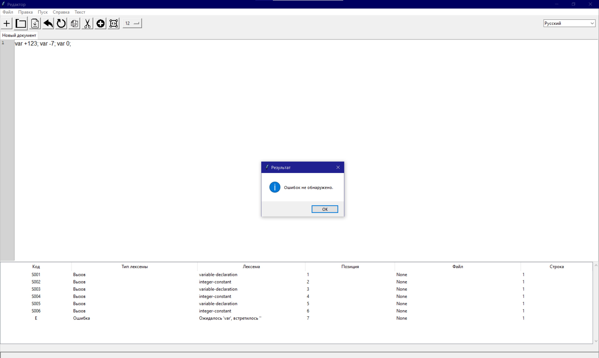
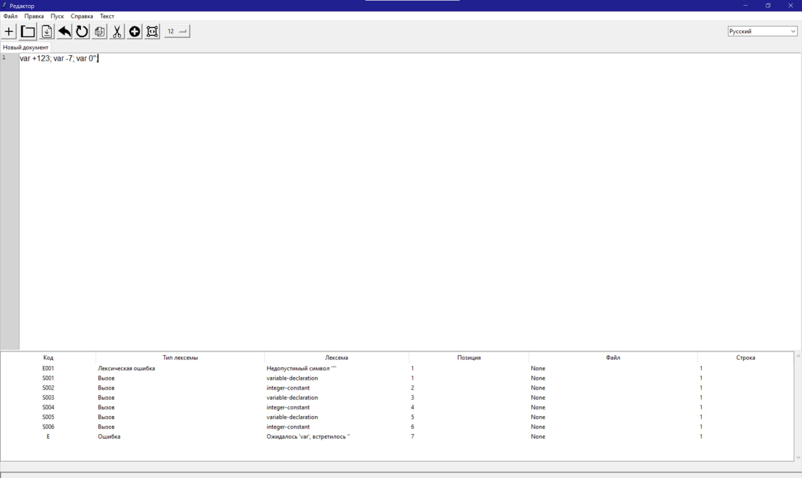

### Программа для лексического и синтаксического анализа

**Цель:** Реализация лексического и синтаксического анализа выражений объявления переменных на языке Python с использованием **метода рекурсивного спуска**.

---

### 📘 Грамматика

**Обозначение грамматики G для `<variable-declaration>`:**

```
<variable-declaration> → var <integer-constant> {; <variable-declaration>}
<integer-constant>      → [+ | -] <digit> {<digit>}
```

где `<digit> ∈ {0, 1, ..., 9}`

---

### 🔤 Язык, задаваемый грамматикой

Множество допустимых выражений:

```
L = { var c₁ [; var c₂ ; ... ; var cₙ] ∣ cᵢ ∈ (["+" | "-"]?[0-9]+), n ≥ 1 }
```

Примеры допустимых строк:

* `var 10`
* `var -5; var +42; var 0`

---

### 📚 Классификация грамматики

* **Тип грамматики:** Контекстно-свободная (Context-Free Grammar, CFG)
* **Метод анализа:** Рекурсивный спуск (Recursive Descent Parsing)

---

### 🔁 Схема вызова функций

*(Вставьте схему вызова функций, если она у вас оформлена как диаграмма или блок-схема. Ниже примерная заглушка для иллюстрации.)*

📷 Скриншот схемы вызова:


---

### 🧪 Тестовые примеры

Примеры входных строк и соответствующих результатов разбора:

* Ввод: `var +123; var -456; var 0`
  ✅ Корректно
* Ввод: `var 12a; var 34`
  ❌ Ошибка: недопустимый символ 'a'

📷 Скриншот работы с тестами:


---

### 🧩 Дополнительное задание

📷 Скриншот дополнительного задания:
